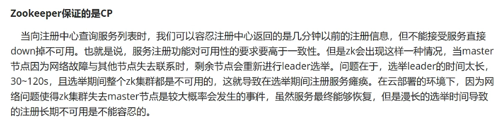
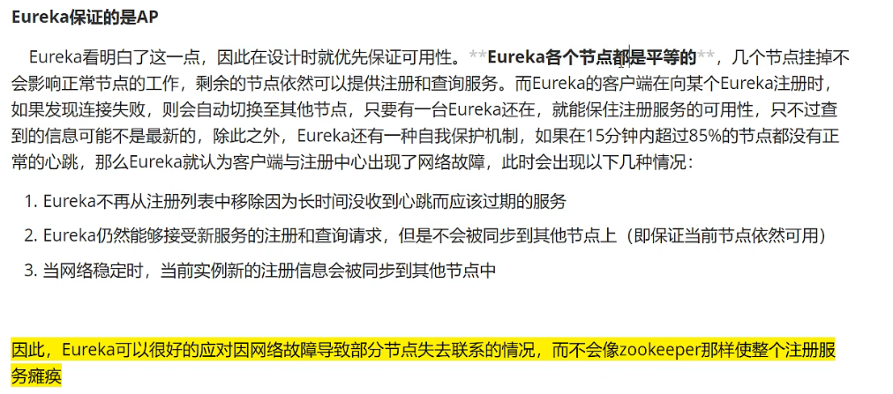

## SpringCloud形式的微服务架构总览

**1.何为微服务架构与微服务？**

**总体概括**

微服务架构是一种新型的架构模式，他一改传统的All In One的风格，将一个整体的程序模块分割成一组组服务，每个服务作为一个进程在运行并且能够部署到不同的运行环境中，甚至可以使用不同的数据库，然后各个服务之间通过HTTP协议（在springcloud中）互相调用访问通信，进而完成一个系统的整体业务。

微服务强调的是服务的大小，它关注的是某一个点，是具体解决某一个问题/提供落地对应服务的一个服务应用，狭义的看，可以看作是IDEA中的一个个微服务工程，或者Moudel。IDEA 工具里面使用Maven开发的一个个独立的小Moudel，它具体是使用SpringBoot开发的一个小模块，专业的事情交给专业的模块来做，一个模块就做着一件事情。强调的是一个个的个体，每个个体完成一个具体的任务或者功能。

**从技术维度上**

微服务化的核心就是将传统的一站式应用，根据业务拆分成一个一个的服务，彻底地去耦合，每一个微服务提供单个业务功能的服务，一个服务做一件事情，从技术角度看就是一种小而独立的处理过程，类似进程的概念，能够自行单独启动或销毁，拥有自己独立的数据库。

2.微服务架构的四个核心问题

* 微服务有很多，客户如何去访问这些服务（api网关）
* 微服务有很多，服务之间应该怎么通信（http通信，rpc通信）
* 微服务有很多，应该怎么统一管理（服务注册与发现）
* 服务挂了怎么办（服务的熔断机制）

这一套核心问题的解决方案就是springcloud，他是一种生态是基于springboot的

3.Eureka对比zookeeper

3.1 ACID原则与CAP原则

（mysql，sqlservice，oracle）：这些的传统数据库都是遵循ACID原则

A:原子性，C:一致性,I:隔离性,D:持久性

（redis，mongdb）：这些缓存nosql都是遵循的CAP原则

C:强一致性 A:可用性 P:分区容错性

CAP:一般支持三进二也就是三者只能兼顾其二

作为服务注册中心Eureka比zookeeper好在哪里

一个分布式系统只能满足cap原则中的两个，由于分区容错性P是必须要兼备的，那么剩下的就在C/A中选其一

* Eureka选择的是CP
* Zookeeper选择的是CP

Zookeeper的选举原则

Eureka的自我保护机制

在项目中eureka注册中心才算是服务端，内容提供者与消费者都是客户端

综述：至此springcloud通过eureka配置的服务器集群以及使用ribbon进行负载均衡的本地demo告一段落了，在这个项目中8001-8003是作为服务的提供者，提供数据库的增删改查操作，并且将自身注册到eureka服务器中，而7001-7003作为eureka服务端，组成集群来管理注册的服务提供者，而80则是作为消费者来对8001-8003的服务进行消费，然后负载均衡也在80模块中实现，具体步骤可以看源码与各模块的自述文件。
